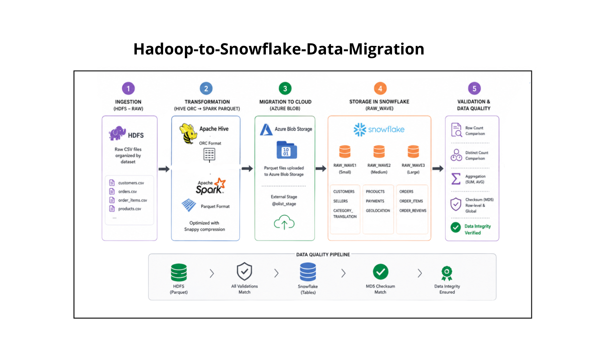

# Hadoop to Snowflake Data Migration

## Overview

This project implements an end-to-end data migration pipeline from a Hadoop-based data lake (HDFS + Hive/ORC) to a cloud data warehouse (Snowflake).

The objective is to modernize a legacy big data architecture by leveraging a cloud-native platform that simplifies data processing, improves performance, and reduces operational complexity.

---

## Architecture

The pipeline follows a structured data lifecycle:

1. Raw Data Ingestion  
   Data is stored in HDFS in raw format (CSV).

2. Transformation  
   Raw data is converted into optimized formats (ORC → Parquet with Snappy compression).

3. Migration  
   Transformed datasets are transferred to cloud storage (Azure Blob) and loaded into Snowflake using external stages.

4. Validation  
   Data consistency is verified between Hadoop and Snowflake using:
   - Row count comparison  
   - Distinct value checks  
   - Aggregation validation  
   - MD5 checksum (global table integrity)
   

---

## Data Pipeline

HDFS (Raw)  
→ ORC Tables (Hive)  
→ Parquet (Ready Layer)  
→ Azure Blob Storage  
→ Snowflake (RAW_WAVE schemas)

---

## Key Features

- Distributed data processing using Spark
- Optimized storage with Parquet + Snappy
- Cloud ingestion using Snowflake stages
- Automated validation (counts, aggregates, checksums)
- Data integrity verification using MD5 hashing
- Audit tracking with Snowflake COPY_HISTORY

---

## Validation Strategy

Validation is performed by executing equivalent queries on both environments and ensuring identical results:

- Exact row count matching
- Business-level metrics validation (aggregations)
- End-to-end checksum comparison for full data integrity

---

## Technologies Used

- Hadoop (HDFS, Hive)
- Apache Spark
- Parquet / ORC
- Azure Blob Storage
- Snowflake
- SQL

---

## Conclusion

This project demonstrates a complete migration workflow from a legacy Hadoop ecosystem to a scalable cloud data warehouse.

The approach ensures data integrity, reproducibility, and validation at each stage of the pipeline.
